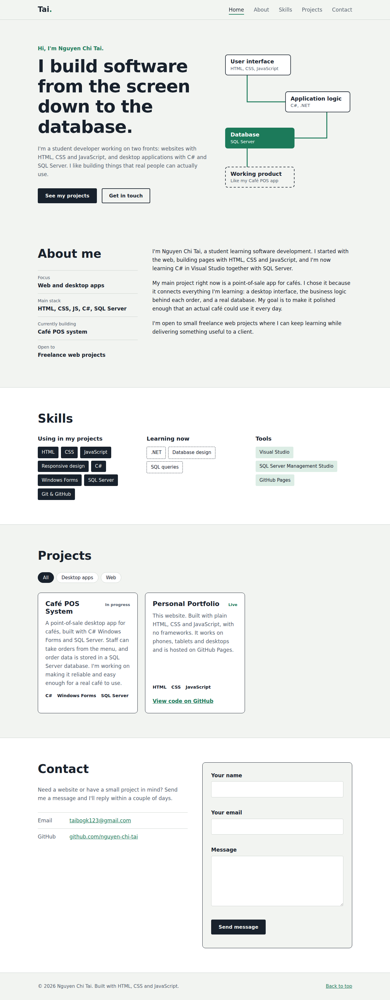

# Personal Portfolio Website

Personal portfolio of Nguyen Chi Tai, built from scratch with plain **HTML, CSS and JavaScript** (no frameworks).

**Live site:** https://nguyen-chi-tai.github.io/personal-portfolio/



## Features

- Sections: Home, About, Skills, Projects, Contact
- Responsive layout for desktop, tablet and phone, with a hamburger menu on small screens
- Navigation highlights the section currently on screen (`IntersectionObserver`)
- Project filter by category (Desktop apps / Web)
- Contact form with client-side validation that opens the visitor's email app (`mailto:`)
- Animated path diagram in the hero, disabled when the user prefers reduced motion
- Keyboard focus styles and screen-reader labels

## Project structure

```
personal-portfolio/
├── index.html     # page structure and content
├── style.css      # design tokens, layout, responsive rules
├── script.js      # menu, active nav link, project filter, form validation
└── screenshots/   # images used in this README
```

## Run locally

Open `index.html` in a browser, or run a small local server:

```bash
python3 -m http.server 8000
# then open http://localhost:8000
```

## What I learned

- Building layouts with CSS Grid and Flexbox
- Writing media queries for different screen sizes
- Handling DOM events and validating form input in JavaScript
- Publishing a static site with GitHub Pages
